<!-- README.md - ChefMate -->

<body style="background: linear-gradient(135deg, #fef3c7 0%, #fde68a 100%); margin: 0; padding: 20px;">

<div style="
    background-color: #ffffff;
    border-left: 4px solid #f59e0b;
    padding: 1.5rem;
    margin: 2rem 0;
    border-radius: 0 8px 8px 0;
    box-shadow: 0 4px 6px rgba(245, 158, 11, 0.15);
">

<p style="font-size: 1.2rem; color: #78350f; font-weight: 600;">Application Mobile de Recettes & Inspirations Culinaires — API Spoonacular & Firebase</p>

</div>

<br>

<div align="center" style="
    background: linear-gradient(90deg, #ea580c 0%, #f59e0b 100%);
    color: white;
    padding: 2.5rem 2rem;
    border-radius: 20px;
    box-shadow: 
        0 15px 35px rgba(234, 88, 12, 0.25),
        inset 0 1px 0 rgba(255, 255, 255, 0.3);
    border: 3px solid rgba(255, 255, 255, 0.2);
    position: relative;
    overflow: hidden;
">
    
<br>

<div style="position: absolute; top: 0; right: 0; padding: 1rem;">
    
    
    
    
    
</div>

<br>

<h1 style="margin-top: 2rem; font-size: 2.8rem;">🍽️ ChefMate</h1>
<p style="font-size: 1.1rem; opacity: 0.95; max-width: 800px; margin: 1rem auto; line-height: 1.6;">
ChefMate est votre compagnon culinaire intelligent. Développée pour Android, elle utilise l'API Spoonacular et Firebase pour vous offrir un accès illimité à des milliers de recettes, des recommandations personnalisées et une gestion intuitive de vos favoris. Découvrez, cuisinez et partagez le plaisir de la cuisine.
</p>

</div>

</body>

---

## 📖 Table des Matières

### 🍳 **Découverte & Présentation**
- [🎯 Contexte & Vision](#-contexte--vision)
- [✨ Fonctionnalités Principales](#-fonctionnalités-principales)
- [📱 Galerie d'Écrans](#-galerie-décrans)

### ⚙️ **Développement & Architecture**
- [🏗️ Architecture Technique](#️-architecture-technique)
- [🛠️ Technologies Utilisées](#️-technologies-utilisées)
- [📦 Installation & Configuration](#-installation--configuration)
- [▶️ Guide d'Utilisation](#️-guide-dutilisation)

### 🌐 **Ressources & Communauté**
- [🎥 Vidéo de Démonstration](#-vidéo-de-démonstration)
- [🤝 Contribution](#-contribution)
- [📜 Licence](#-licence)
- [📞 Contact](#-contact)

---

## 🎯 Contexte & Vision

ChefMate est né d'une simple idée : **rendre la cuisine accessible, inspirante et organisée pour tous**.

Dans un monde où trouver la bonne recette peut être fastidieux, cette application mobile interactive utilise la puissance de **l'API Spoonacular** et la flexibilité de **Firebase** pour offrir une expérience culinaire unique. Elle va au-delà d'un simple livre de recettes en ligne en proposant des **recommandations intelligentes**, une **recherche avancée** et un **espace personnel** pour suivre vos créations.

**🔥 Notre Mission :** Transformer chaque utilisateur, du débutant au chef expérimenté, en un cuisinier confiant et créatif, en simplifiant la découverte, la planification et l'exécution de repas délicieux.

---

## ✨ Fonctionnalités Principales  

### ✅ **Découverte & Exploration Illimitée**
- **Recettes Aléatoires** : Découvrez une nouvelle inspiration à chaque ouverture.
- **Navigation par Catégories** : Parcourez facilement (Apéritifs, Plats principaux, Desserts, etc.).
- **Filtres Avancés** : Affinez par régime (végétarien, sans gluten), temps de préparation, difficulté et ingrédients.

### ✅ **Recherche Intelligente & Personnalisation**
- **Recherche Vocale & Textuelle** : Trouvez des recettes par nom, ingrédient ou même par ce qu'il vous reste dans le frigo.
- **Système de Recommandations** : Recevez des suggestions adaptées à vos goûts et à votre historique.
- **Favoris & Collections** : Sauvegardez vos recettes préférées et créez des collections thématiques (« Repas de fête », « Pique-nique »).

### ✅ **Expérience de Cuisine Complète**
- **Fiches Recettes Détaillées** : Instructions étape par étape, listes d'ingrédients avec quantités, et notes de préparation.
- **Multimédia Intégré** : Photos appétissantes et vidéos tutoriels pour guider les étapes délicates.
- **Mode « Cuisiner »** : Mode plein écran avec minuterie intégrée pour ne manquer aucune étape.

### ✅ **Social & Productivité**
- **Feedback Communautaire** : Notez et commentez les recettes pour aider les autres.
- **Liste de Courses Automatique** : Générez instantanément une liste d'achats à partir des ingrédients d'une recette.
- **Partage** : Partagez facilement vos découvertes culinaires sur les réseaux sociaux ou avec vos amis.

---

## 📱 Galerie d'Écrans

<div align="center">
  <table>
    <tr>
      <td align="center"><strong>Premiers Pas</strong><br>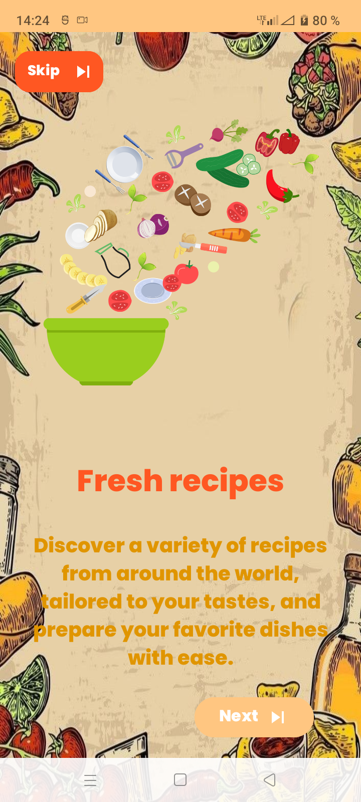</td>
      <td align="center"><strong>Connexion</strong><br>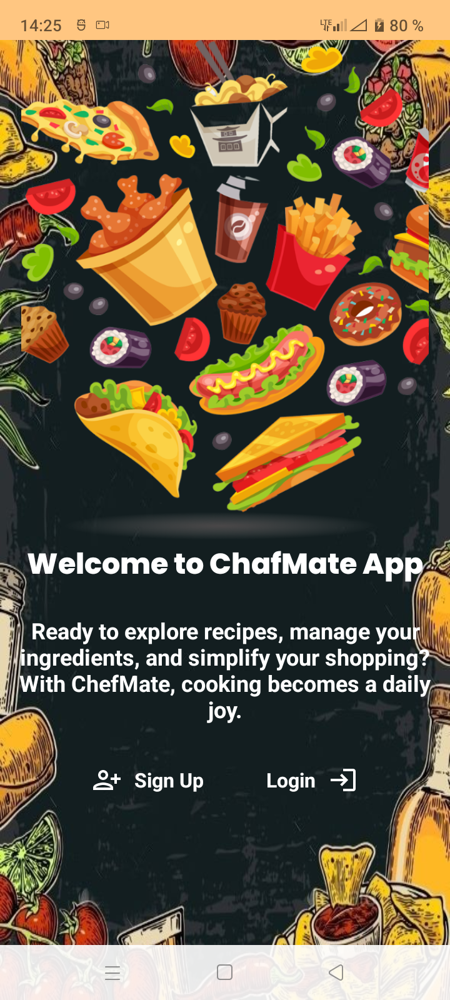</td>
      <td align="center"><strong>Accueil & Découverte</strong><br>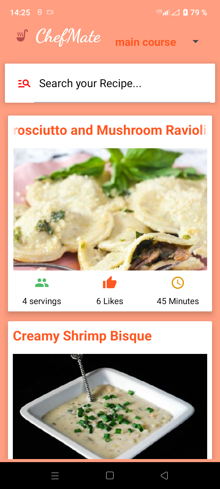</td>
      <td align="center"><strong>Navigation</strong><br>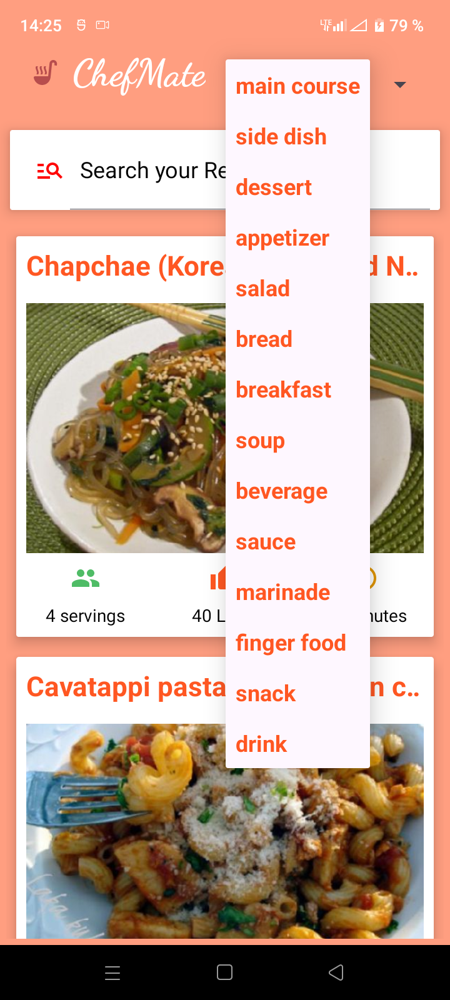</td>
    </tr>
    <tr>
      <td align="center"><em>Introduction à l'app</em></td>
      <td align="center"><em>Authentification</em></td>
      <td align="center"><em>Dashboard des recettes</em></td>
      <td align="center"><em>Explorer par type</em></td>
    </tr>
  </table>

  <br>

  <table>
    <tr>
      <td align="center"><strong>Recherche</strong><br>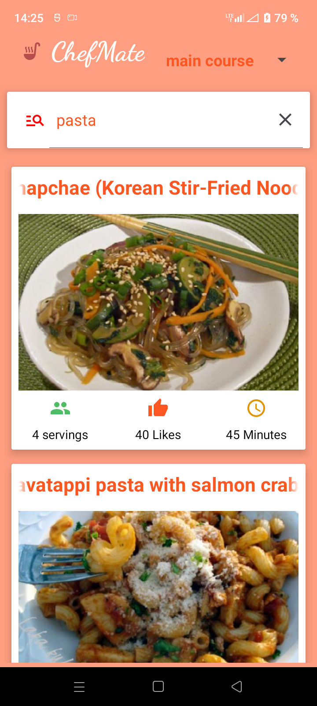</td>
      <td align="center"><strong>Détails (1/3)</strong><br>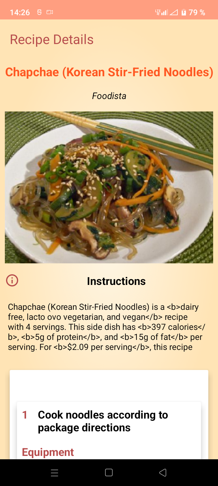</td>
      <td align="center"><strong>Détails (2/3)</strong><br>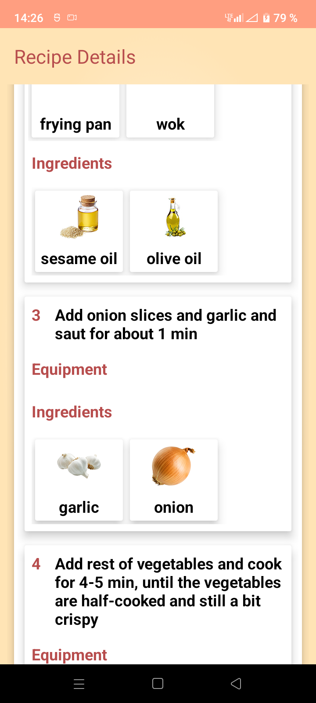</td>
      <td align="center"><strong>Détails (3/3)</strong><br>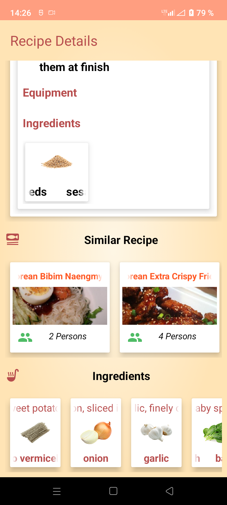</td>
    </tr>
    <tr>
      <td align="center"><em>Trouver une recette</em></td>
      <td align="center"><em>Vue d'ensemble</em></td>
      <td align="center"><em>Liste des ingrédients</em></td>
      <td align="center"><em>Étapes de préparation</em></td>
    </tr>
  </table>
</div>

---

## 🏗️ Architecture Technique

ChefMate est construite sur une architecture **Android Moderne (MVVM)** robuste, conçue pour la performance, la maintenabilité et une excellente expérience utilisateur.


### 🔄 **Flux de Données (Unidirectionnel)**
1.  **UI** déclenche une action (ex: rechercher une recette).
2.  **ViewModel** expose cette action au `UseCase`.
3.  **UseCase** exécute la logique métier et demande les données au `Repository`.
4.  **Repository** décide de la source (`local` en cache ou `remote` via API).
5.  Les données remontent au **ViewModel** via `LiveData`/`StateFlow`.
6.  L'**UI** observe et se met à jour automatiquement.

**Concepts Clés :**
- **MVVM & Clean Architecture** : Séparation stricte des responsabilités, code testable.
- **Repository Pattern** : Source unique de vérité, abstraction totale de la source de données.
- **API Spoonacular** : Source principale de données pour +360k recettes.
- **Firebase** : Authentification des utilisateurs et stockage des données personnelles (favoris, notes).
- **Mode Hors-Ligne First** : Les recettes consultées sont mises en cache pour une consultation ultérieure sans réseau.

---

## 🛠️ Technologies Utilisées  

### 📱 **Développement Mobile**
| Technologie | Rôle dans ChefMate |
|-------------|---------------------|
| **Java** | Langage principal pour toute la logique applicative. |
| **Android SDK** | Framework natif pour construire l'interface et les fonctionnalités. |
| **Android Studio** | IDE officiel pour le développement, le débogage et l'empaquetage. |
| **XML** | Définition des layouts, des menus et des ressources visuelles. |

### ☁️ **Backend, API & Données**
| Technologie | Rôle dans ChefMate |
|-------------|---------------------|
| **Spoonacular API** | Le cœur de l'application. Fournit l'accès à une base de données massive de recettes, d'images et d'informations nutritionnelles. |
| **Firebase Authentication** | Gère l'inscription et la connexion sécurisée des utilisateurs (Email/Google). |
| **Cloud Firestore** | Stocke les données utilisateur : recettes favorites, notes personnelles, historiques de recherche. |
| **Retrofit** | Client HTTP de type sécurisé pour effectuer les appels réseau à l'API Spoonacular. |
| **Gson** | Convertit les réponses JSON de l'API en objets Java exploitables. |

### 📚 **Bibliothèques & Design**
| Bibliothèque | Utilisation |
|--------------|-------------|
| **Picasso/Glide** | Chargement, cache et affichage optimisé des images de recettes depuis Internet. |
| **Room Persistence** | Base de données SQLite locale pour mettre en cache les recettes et permettre une navigation hors-ligne fluide. |
| **ViewModel & LiveData** | Composants d'architecture pour conserver les données à travers les changements de configuration (rotation) et créer une UI réactive. |
| **Material Components** | Implémentation des guidelines Material Design pour une interface moderne et cohérente. |

---

## 📦 Installation & Configuration

### **Prérequis**
- **Android Studio** (version Flamingo ou ultérieure recommandée).
- **JDK 17** (Java Development Kit).
- Un **appareil ou émulateur Android** avec API niveau 24 (Android 7.0) minimum.
- Une **clé API Spoonacular** (gratuite avec limites) depuis [spoonacular.com/food-api](https://spoonacular.com/food-api).
- Un **compte Firebase** pour le backend.

### **Étapes pour Développeurs**

1.  **Cloner le dépôt et ouvrir le projet :**
    ```bash
    git clone https://github.com/krikounoureddine/ChefMate.git
    cd ChefMate
    # Ouvrir le dossier dans Android Studio
    ```

2.  **Configurer votre clé API Spoonacular :**
    - Dans le fichier `local.properties` à la racine du projet, ajoutez :
      ```
      SPOONACULAR_API_KEY="VOTRE_CLE_API_ICI"
      ```
    - Cette clé sera injectée dans le `BuildConfig` pour être utilisée par Retrofit.

3.  **Configurer Firebase (Comme pour QuickShop) :**
    - Créez un projet "ChefMate" sur la [Console Firebase](https://console.firebase.google.com).
    - Ajoutez une application Android et téléchargez le fichier `google-services.json`.
    - Placez-le dans le dossier `app/` de votre projet.

4.  **Synchroniser, compiler et exécuter :**
    - Android Studio fera une synchronisation Gradle pour télécharger les dépendances.
    - Compilez (`Build > Make Project`), puis lancez sur un appareil (`Run 'app'`).

---

## ▶️ Guide d'Utilisation

### **Premiers Pas dans ChefMate**
1.  **Découvrir** : À l'ouverture, parcourez les recettes aléatoires et les catégories mises en avant.
2.  **Créer un compte** : Inscrivez-vous pour débloquer les favoris, les notes et les recommandations personnalisées.
3.  **Explorer** : Utilisez l'onglet de recherche ou naviguez dans les catégories pour trouver l'inspiration.

### **Utiliser une Recette au Quotidien**
1.  **Trouver** : Recherchez "poulet au citron" ou filtrez par "moins de 30 minutes" et "végétarien".
2.  **Consulter** : Sur la fiche recette, lisez le résumé, les ingrédients et les instructions.
3.  **Cuisiner** : Activez le **mode Cuisson** pour un guide pas-à-pas avec minuterie.
4.  **Sauvegarder** : Ajoutez aux favoris, notez vos modifications ou générez une liste de courses.

### **Fonctionnalités Avancées**
- **Liste de Courses** : Dans une recette, appuyez sur l'icône « chariot » pour ajouter tous les ingrédients à votre liste.
- **Recommandations** : Plus vous utilisez l'app, plus les suggestions de l'onglet « Pour Vous » seront pertinentes.
- **Partage** : Partagez le lien d'une recette ou une photo de votre réalisation directement depuis l'app.

> 💡 **Astuce** : En mode paysage sur tablette, l'interface s'adapte pour afficher côte à côte la liste des recettes et les détails.

---

## 🎥 Vidéo de Démonstration

<div align="center">

[](https://drive.google.com/file/d/1V480KQCXkqr1R-E9j5I7X8FYxFfLUdV2/view?usp=sharing)

*Parcourez l'interface, découvrez le processus de recherche d'une recette et voyez les détails interactifs en action.*

</div>

---

## 🤝 Contribution

ChefMate est un projet open-source, et les contributions sont les bienvenues pour l'enrichir !

### **Comment Contribuer ?**
1.  **Ouvrir une Issue** : Signalez un bug ou proposez une nouvelle fonctionnalité sur [GitHub](https://github.com/krikounoureddine/ChefMate/issues).
2.  **Soumettre du Code** :
    ```bash
    # 1. Forkez le dépôt
    # 2. Créez une branche pour votre contribution
    git checkout -b feature/amelioration-recette
    # 3. Développez et committez
    git commit -m "feat: ajout d'un filtre par saison"
    # 4. Poussez et ouvrez une Pull Request
    ```

### **Domaines Prioritaires**
- **Tests** : Augmenter la couverture par des tests unitaires et d'intégration.
- **Accessibilité** : Améliorer le support des lecteurs d'écran et le contraste.
- **Nouvelles APIs** : Intégrer une API de listes de courses ou de nutrition.
- **Traductions** : Ajouter de nouvelles langues (i18n).

---

## 📜 Licence

Ce projet est distribué sous la licence **MIT**, une licence open-source permissive.


---

## 📞 Contact

### 👤 **Noureddine Krikou**
**💼 Développeur Android Full Stack & Passionné de Tech Culinaire**

[](https://github.com/krikounoureddine)
[](https://krikounoureddine.github.io)
[](https://www.linkedin.com/in/noureddine-krikou)

📧 **Une question, un retour ou une opportunité ? N'hésitez pas :**
[](mailto:contact@krikou.dev)

---

## ⭐ Pourquoi ChefMate ?

### ✅ **Ce Projet en Tant que Démonstrateur Technique**
ChefMate n'est pas qu'une app de recettes. C'est une vitrine concrète de compétences techniques avancées :
- **Intégration d'API REST Complexe** : Consommation et modélisation des données de Spoonacular.
- **Architecture Moderne Android** : Implémentation de MVVM, Clean Architecture et Repository Pattern.
- **Gestion d'État et Données** : Maîtrise de `LiveData`, `ViewModels`, et synchronisation multi-sources (Cache, API, Firebase).
- **UX/UI Mobile** : Conception d'une interface intuitive, responsive et engageante pour une application grand public.

### 🎯 **Valeur pour les Recruteurs et Collaborateurs**
Ce projet démontre la capacité à :
1.  **Concevoir et Architecturer** une application mobile complète, de A à Z.
2.  **Travailler avec des Technologies Cloud et Tierces** (Firebase, APIs externes) de manière robuste.
3.  **Résoudre un Problème Utilisateur Réel** avec une solution technique élégante, scalable et maintenable.

> ⭐ **Vous avez trouvé ce projet intéressant ?** Laissez une **étoile** sur le [dépôt GitHub](https://github.com/krikounoureddine/ChefMate) ! C'est le meilleur moyen de le soutenir.

<div align="center" style="margin-top: 3rem; padding: 2rem; background: linear-gradient(to right, #fffbeb, #fef3c7); border-radius: 16px; border: 2px dashed #f59e0b;">

---

## 🍽️ ChefMate • Votre inspiration culinaire, intelligemment organisée.

[](https://github.com/krikounoureddine/ChefMate)
[](https://github.com/krikounoureddine/ChefMate/releases)

</div>


# 🍽️ ChefMate - Application Mobile de Recettes de Cuisine

## 📌 Contexte du Projet
ChefMate est une application mobile interactive qui simplifie l'accès aux recettes de cuisine en utilisant des technologies avancées telles que **Firebase** et **l'API Spoonacular**. L'application propose un système de recommandations personnalisées et une interface intuitive pour répondre aux besoins des utilisateurs en quête d'inspiration culinaire.

---

## 🚀 Fonctionnalités Principales

✅ **Consultation des Recettes**  
- Affichage dynamique des recettes avec des **filtres avancés** (type de plat, ingrédients, temps de cuisson...).  

✅ **Recherche Avancée**  
- Recherche par **ingrédients**, **type de plat**, ou **mots-clés**.  

✅ **Système de Recommandations**  
- Suggestions personnalisées basées sur les préférences et interactions de l'utilisateur.  

✅ **Feedback Utilisateur**  
- Possibilité de **noter et commenter** les recettes pour améliorer les suggestions.  

✅ **Interaction Multimédia**  
- Chaque recette inclut des **images, vidéos, et instructions détaillées** pour une meilleure expérience.  

---

## 🛠 Technologies Utilisées

🔹 **Backend & Base de Données** : Firebase (Firestore, Authentication)  
🔹 **Frontend & Développement Mobile** : Java, Android Studio, XML  
🔹 **APIs & Réseaux** : Spoonacular API (recettes), Retrofit (requêtes HTTP), Gson (JSON Parsing)  
🔹 **Gestion des Médias** : Picasso (chargement des images)  

---

## 📲 Captures d'Écran

### 📌 Découverte de l'application 

| In1 | In2 | In3 |
|---------|----------------------|----------------------|
 | 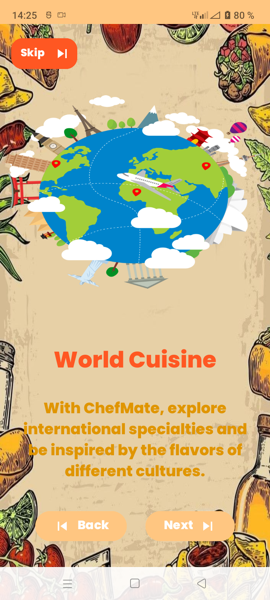 | 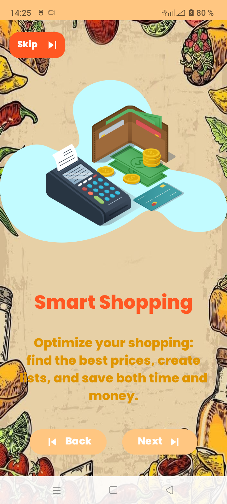

### 🔑 connexion et enregistrement

| In1 | In2 | in3 |
|---------|----------------------|----------------------|
 | 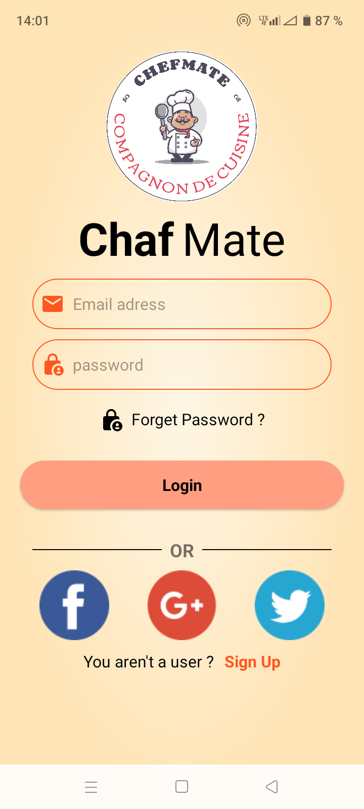 | 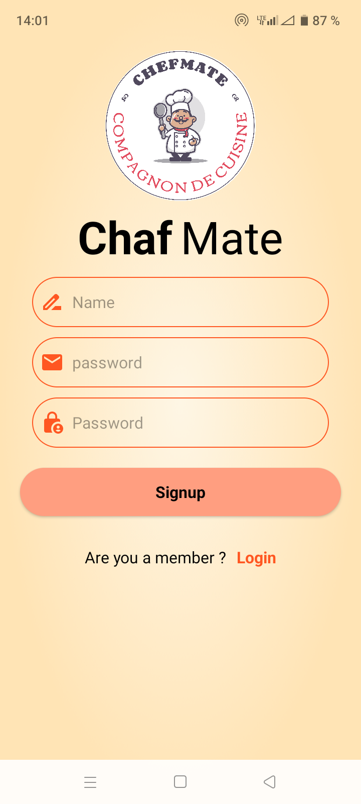

### 🍽️ Accueil La page des recettes aléatoire

| In1 |
|---------|
 |

### 📂 les recettes par catégories

| In1 |
|---------|
 |

### 🔍 Recherche de Recettes

| In1 |
|---------|
 |

### 📖 Les détails d’une recette

| In1 | In2 | In3 |
|---------|----------------------|----------------------|
 |  | 

---

## Vidéo de Présentation

🎥 [Voir la vidéo de présentation Cliquez ici](https://drive.google.com/file/d/1V480KQCXkqr1R-E9j5I7X8FYxFfLUdV2/view?usp=sharing)

---

✅ **Profitez d’une expérience culinaire unique avec Cook&Save !**
